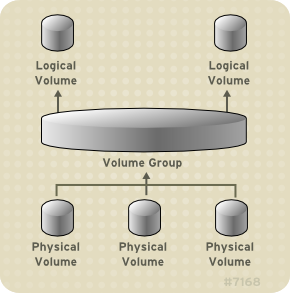

# vm-raid-lab

Provision a Centos 7.9 virtual machine and
provision additional disks for RAID configuration.

- [Getting Started](#getting-started)
- [Standard Partitioning in Linux](#standard-partitioning-in-linux)
  - [Partition a drive and create a file system](#partition-a-drive-and-create-a-file-system)
  - [Mount the filesystem](#mount-the-filesystem)
  - [Mount the filesystem automatically](#mount-the-filesystem-automatically)
  - [Check mounting](#check-mounting)
- [Logical Volumes](#logical-volumes)
  - [LVM Architecture](#lvm-architecture)
  - [LVM Components](#lvm-components)
  - [Install the lvm packages](#install-the-lvm-packages)
  - [Initializing Physical Volumes](#initializing-physical-volumes)
  - [Scanning for Block Devices](#scanning-for-block-devices)
  - [Displaying Physical Volumes](#displaying-physical-volumes)
  - [Creating Volume Groups](#creating-volume-groups)
  - [RAID Logical Volumes](#raid-logical-volumes)
  - [Displaying Logical Volumes](#displaying-logical-volumes)
  - [Growing Logical Volumes](#growing-logical-volumes)
  - [Creating an XFS File System](#creating-an-xfs-file-system)
  - [Mount Logical Volume](#mount-logical-volume)
- [Resources](#resources)

## Getting Started

Update [machines.yml](machines.yml) to configure the VMs that will be created.

```bash
vagrant up
vagrant ssh centos7-raid
vagrant halt
vagrant destroy
```

## Standard Partitioning in Linux

### Partition a drive and create a file system

```bash
# list devices
ls /dev/sd*

# partition with fdisk
fdisk /dev/sdb

# list devices
ls /dev/sd*

# create a file system
# /sbin/mkfs.ext4 -L /data /dev/sdb1
```

### Mount the filesystem

```bash
# create a directory for the mounting
mkdir /data

# mount the drive to the created directory
mount /dev/sdb1 /data

# show all the current mounted systems
mount
```

### Mount the filesystem automatically

For this to happen, we need to add an entry in /etc/fstab file

```bash
vim /etc/fstab
# LABEL=/data     /data   ext4    defaults        1       2
```

### Check mounting

```bash
# list all the mounting with UUID
blkid

# list block devices
lsblk -f
```

## Logical Volumes

Volume management creates a layer of abstraction over physical storage, allowing you to create logical storage volumes.

### LVM Architecture

The underlying physical storage unit of an LVM logical volume is a block device such as a partition or whole disk. This device is initialized as an LVM physical volume (PV).

To create an LVM logical volume, the physical volumes are combined into a volume group (VG). This creates a pool of disk space out of which LVM logical volumes (LVs) can be allocated.



### LVM Components

Describes the components of an LVM Logical volume.

- Physical Volumes
  - The underlying physical storage unit of an LVM logical volume is a block device such as a partition or whole disk. To use the device for an LVM logical volume, the device must be initialized as a physical volume (PV). Initializing a block device as a physical volume places a label near the start of the device.
- Volume Groups
  - Physical volumes are combined into volume groups (VGs). This creates a pool of disk space out of which logical volumes can be allocated.
- Logical Volumes
  - In LVM, a volume group is divided up into logical volumes.
    - Linear Volumes
    - Striped Logical Volumes
    - RAID Logical Volumes
    - Thinly-Provisioned Logical Volumes (Thin Volumes)
    - Snapshot Volumes
    - Thinly-Provisioned Snapshot Volumes
    - Cache Volumes

### Install the lvm packages

```bash
yum reinstall lvm2
```

### Initializing Physical Volumes

Use the pvcreate command to initialize a block device to be used as a physical volume. Initialization is analogous to formatting a file system.

```bash
pvcreate /dev/sdb  /dev/sdc  /dev/sdd  /dev/sde
```

### Scanning for Block Devices

```bash
lvmdiskscan
```

### Displaying Physical Volumes

```bash
pvdisplay
pvscan
pvs
```

### Creating Volume Groups

```bash
vgcreate vg1 /dev/sdb  /dev/sdc  /dev/sdd  /dev/sde
vgdisplay vg1
vgscan
```

### RAID Logical Volumes

LVM supports RAID0/1/4/5/6/10

```bash
# 2-Way RAID1
lvcreate --type raid1 -m 1 -L 1G -n lv1 vg1

# RAID5 array (3 stripes + 1 implicit parity drive)
lvcreate --type raid5 -i 3 -L 1G -n lv2 vg1

# RAID6 array (3 stripes + 2 implicit parity drives)
lvcreate --type raid6 -i 3 -L 1G -n lv3 vg1

# 2-way RAID10 array with 3 stripes that is 10 gigabytes in size with a maximum recovery rate of 128 kiB/sec/device
lvcreate --type raid10 -i 2 -m 1 -L 9G --maxrecoveryrate 128 -n lv4 vg1

```

### Displaying Logical Volumes

There are three commands you can use to display properties of LVM logical volumes: `lvs` , `lvdisplay` , and `lvscan` .

```bash
lvs
lvdisplay -v /dev/vg1/lv4
lvscan
```

### Growing Logical Volumes

To increase the size of a logical volume, use the lvextend command.

```bash
lvextend -l +100%FREE /dev/vg1/lv4
```

### Creating an XFS File System

```bash
mkfs.xfs /dev/vg1/lv4
```

### Mount Logical Volume

```bash
mount /dev/vg1/lv4 /mnt
df
```

## Resources

- [LVM Configuration Examples](https://access.redhat.com/documentation/en-us/red_hat_enterprise_linux/7/html/logical_volume_manager_administration/lvm_examples)
- [RHEL 7 - Storage Administration Guide](https://access.redhat.com/documentation/en-us/red_hat_enterprise_linux/7/html/storage_administration_guide/index)
- [RHEL 7 - Logical Volume Manager Administration](https://access.redhat.com/documentation/en-us/red_hat_enterprise_linux/7/html/logical_volume_manager_administration/index)
- [RHEL 7 - RAID Logical Volumes](https://access.redhat.com/documentation/en-us/red_hat_enterprise_linux/7/html/logical_volume_manager_administration/lv#raid_volume_create)
- [bento/centos-7.9](https://app.vagrantup.com/bento/boxes/centos-7.9)
- [Vagrant Disks](https://developer.hashicorp.com/vagrant/docs/disks/usage)
- [Add Disk Storage to VirtualBox on Centos7](https://tzhwang.com/2020/10/19/add-disk-storage-to-virtualbox-on-centos7/)
- [Simple Partitioning with Ansible Storage Role – Storage APIs](https://storageapis.wordpress.com/2022/01/28/simple-partitioning-with-ansible-storage-role/)
- [Ansible User Guide](https://docs.ansible.com/ansible/2.8/user_guide/index.html)
- [Vagrant Advanced Examples](https://ctrlnotes.com/vagrant-advanced-examples/#-insert-custom-ssh-public-key-to-the-vm)
- [Ansible tips and tricks | Sample Ansible setup | Sample directory layout](https://docs.ansible.com/ansible/latest/tips_tricks/sample_setup.html#id1)
- [Red Hat Enterprise Linux (RHEL) System Roles](https://access.redhat.com/articles/3050101)
- [Ways to check for open ports on RHEL](https://access.redhat.com/discussions/3539801)
- [Logical Volume Manager (LVM) versus standard partitioning in Linux](https://www.redhat.com/sysadmin/lvm-vs-partitioning)
- [Ansible best practices: using project-local collections and roles](https://www.jeffgeerling.com/blog/2020/ansible-best-practices-using-project-local-collections-and-roles)
- [Ansible Galaxy Support](https://docs.ansible.com/ansible-tower/latest/html/userguide/projects.html#ansible-galaxy-support)
